# CUDA GEMM Optimization Report

本报告要回答的核心问题：

* 性能瓶颈在哪里？（如何系统定位）
* 为什么某一步优化有效？（性能模型驱动）

## 1、背景与问题描述

### 1.1 GEMM简介

GEMM（General Matrix Multiply）是深度学习训练与推理中计算量占比最高的基础算子。

GEMM 的**理论算术强度**分析：

对于矩阵运算：`C = torch.matmul(A, B)`，维度： $(M \times K) \times (K \times N) → (M \times N)$，数据类型：T

* 浮点运算量：
  $$
  F = 2 \times M \times N \times K
  $$

* 数据访问量：
  $$
  D = (M \times K + K \times N + M \times N) \times sizeof(T)
  $$

* 理论算术强度：
  $$
  I_{\text{gemm}}= \frac{F}{D} = \frac{2MNK}{ (M \times K + K \times N + M \times N) \times sizeof(T)}
  $$

> **需要注意的是：这里在计算数据访问量时，默认每个数据只取一次，实际上这是一种极其理想的假设：即假设设备拥有极其巨大的缓存，可以容纳整个矩阵，这样其中的数据就可以无限复用。然而该假设在现有的设备上是不可能的，现实情况是：缓存容量很小，当发出一个访存请求，将数据读取到缓存中后，难以维持完整复用，容易被新的数据挤出缓存。当后续要再次使用这个数据时，就需要重新从更低层级存储中重新加载，所以真正的数据访问量远大于上面计算出的结果。这也就意味着计算出的理论算术强度是一个理想化的极限值，它代表着我们将数据复用做到极致后的理论上限。**
>
> **除了表示理论上限，理论算术强度还有另一个极其重要的作用：当计算出理论算术强度很低，我们就应该明白，该算子的瓶颈一定是在内存访问，不需要花大量时间在优化算法和提升数据重用上，因为上限摆在那里，再如何优化提升也很小。**

对于 GEMM 这类高度依赖分块与复用的算子，其真实性能瓶颈通常出现在更低层级（如共享内存、寄存器或执行管线），因此需要结合具体实现方式来进一步分析。

### 1.2 如何定位性能瓶颈

实践中，GEMM 的性能分析通常采用以**执行资源为中心（execution-centric）**的瓶颈定位方法，即通过分析各类硬件执行资源的利用率与等待状态，判断限制性能的关键因素。

#### 1.2.1 性能瓶颈定位的方法论

**性能瓶颈由“最先被打满的硬件执行资源”决定**。GEMM 算子的性能不由单一因素（如显存带宽或理论算术强度）决定，而是由多个执行资源协同作用。实践中，性能瓶颈的定位通常从计算资源利用率出发，逐步深入到 warp 执行状态、并行度限制及存储层级行为。

1. **计算资源利用率**：是否 Compute-Bound

   首先判断 GEMM 是否受限于计算能力：

   * CUDA Core / Tensor Core 的利用率
   * FMA / Tensor 指令管线的饱和程度

   **判据（经验）**：

   * 计算管线利用率长期低于 70%，通常说明瓶颈不在计算
   * 接近峰值（80%–90%）时，才可能进入计算受限区间

   这一判断直接决定是否值得继续通过增加数据复用、扩大分块等方式追求更高算术强度。当算子已处于计算受限区间时，进一步提升算术强度通常不会带来性能收益，反而可能因增加寄存器压力和降低并行度而导致性能下降。此时优化重点应转向计算管线利用率、指令调度与并行度。

2. **Warp 执行状态**：在“等什么”

   在实践中，warp 执行状态分析通常是定位 GEMM 性能瓶颈的最关键步骤。当计算单元未饱和时，需要分析 warp 的停顿原因，通过分析 warp stall 类型，可以将瓶颈精确映射到具体资源：

   * **Memory Dependency**：等待 global / shared memory 数据
   * **Short Scoreboard**：指令间数据依赖，FMA 链过长
   * **Execution Dependency**：执行管线冲突（如 Tensor Core issue）
   * **Barrier**：线程同步或分块设计不合理

   该步骤可以直接揭示瓶颈位于：

   * 内存访问
   * 指令调度
   * 数据依赖
   * 并发度不足

3. **并行度与资源占用**：是否限制了延迟隐藏

   即使单次访存延迟较高，GEMM 仍可通过足够的并行度隐藏延迟。因此需要进一步检查：

   * Occupancy（活跃 warps 数）
   * 寄存器使用量
   * Shared Memory 占用

   常见现象是：

   **为了提升数据复用而增大分块尺寸，反而导致寄存器或共享内存压力过大，从而降低并行度，最终性能下降。**

4. **内存带宽**：最后才关注的瓶颈

   在合理分块的 GEMM 实现中，显存带宽通常不是主要瓶颈。只有在以下情况下，才需要重点关注 DRAM 带宽：

   * 分块尺寸过小，数据复用不足
   * 计算量不足以摊薄访存开销
   * 极小矩阵或 batch GEMM

   > 当 kernel 从 memory-bound 转向 instruction-issue-bound 时，传统的 memory throughput 指标不再直接反映真实性能瓶颈，必须结合 warp issue 与 pipeline stall 信息进行综合分析。

#### 1.2.2 性能瓶颈如何随条件变化

GEMM 的性能瓶颈并非固定不变，而是随算法参数与问题规模动态变化。

1. **分块尺寸 (TM, TN, TK)**

   **影响趋势**：

   - 增大 TM、TN：
     - 提升数据复用
     - 提高理论算术强度
     - 增加寄存器与共享内存压力
   - 增大 TK：
     - 延长依赖链，降低指令级并行性并增加调度压力
   
   **典型转变**：
   
   - 小分块 → 内存或延迟受限
   - 中等分块 → 计算受限或共享内存受限
   - 过大分块 → 并行度不足，性能下降
   
2. **问题规模 (M, N, K)**

   **影响趋势**：

   - K 较小：
     - 数据复用有限
     - 启动与访存开销占比高
     - 更容易内存或延迟受限
   - K 较大：
     - 数据复用充分
     - 更可能暴露计算或执行管线瓶颈

3. **数据类型与计算路径**

   - FP32（CUDA Core）：
     - 易受指令调度、寄存器压力影响
   - Tensor Core（FP16 / BF16）：
     - 易受指令 issue、管线利用率限制
     - 对分块形状和对齐要求更严格

   这是由于 Tensor Core 指令粒度较大、执行管线更深，其性能高度依赖于持续的指令发射与充分的并行度。

4. **硬件资源配置**

   - SM 数量、L2 容量
   - Shared Memory 带宽与 bank 结构
   - 寄存器文件大小

   不同架构下，**相同分块策略可能导致完全不同的瓶颈位置**。

5. **实现细节**

   - 访存合并与对齐
   - Shared Memory bank conflict
   - 同步策略
   - 指令重排

   这些因素往往决定最终性能是否接近理论上限。

>GEMM 的性能瓶颈并非由单一指标决定，而是由分块策略、问题规模、硬件特性及实现细节等共同作用的结果。
> 实践中的瓶颈定位需要从执行资源利用率出发，结合 warp 执行状态和并行度分析，逐层判断和验证。

### 1.3 本章小结

本文关注的问题可以表述为：在给定硬件架构 G、矩阵规模 (M, N, K)、数据类型 dtype 的条件下，如何设计一个 GEMM kernel，使其性能尽可能逼近理论上限？


## 2、基线实现与瓶颈分析

本节的目的不是展示一个高效的实现，而是给出一个性能分析的起点。因此会刻意避免任何优化手段，以便在后续章节中逐一引入，并分析其对性能的影响。

* naive版本为何这样设计？（刻意简单、原始）
* 使用哪些分析指标？
* 瓶颈是什么？（在当前矩阵规模与数据类型下，naive GEMM 的性能主要受限于 XXX）

### 2.1 基线实现

对于矩阵运算：`C = torch.matmul(A, B)`，维度：M=N=K=4096，矩阵A，B数据类型为 bfloat16 ，矩阵C数据类型为 float。

```c++
__global__ void gemm_naive(
    const __nv_bfloat16* A, 
    const __nv_bfloat16* B, 
    float* C,
    const int M, const int N, const int K
) {
    int row = blockIdx.y * blockDim.y + threadIdx.y;
    int col = blockIdx.x * blockDim.x + threadIdx.x;

    if (row < M && col < N) {
        float sum = 0.0f, a, b;
        for (int kk = 0; kk < K; ++kk) {
            a = __bfloat162float(A[row * K + kk]);
            b = __bfloat162float(B[kk * N + col]);
            sum += a * b;
        }
        C[row * N + col] = sum;
    }
}
```

### 2.2 基线与 cuBLAS 性能对比

| 实现方式           | naive  | cuBLAS |
| ------------------ | ------ | ------ |
| 运行时间（ms）     | 88.628 | 2.684  |
| 实测性能（TFLOPS） | 1.55   | 51.21  |

由此可见，naive 版本的确非常“原始”，有很大优化空间。

### 2.3 瓶颈定位

所有指标均使用 Nsight compute 分析得到

#### 2.3.1 计算资源利用率

Nsight Compute 的统计结果显示，Compute (SM) Throughput [%]=95.34，乍一看可能会以为 gemm_naive kernel 对计算资源的使用率极高，但这与其性能表现矛盾。需通过 **Compute Workload Analysis** 部分进一步分析，具体指标如下图所示。可以发现 gemm_naive kernel 真正用于计算的资源（如FMA）极少，远未达到计算受限的程度。

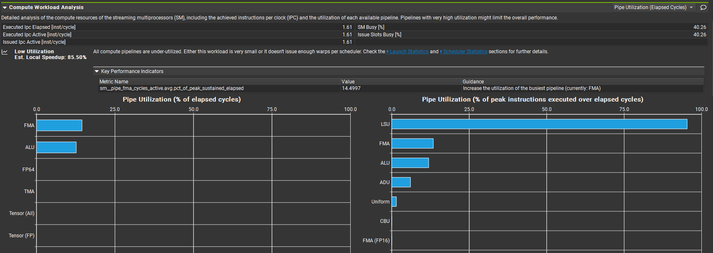

#### 2.3.2 Warp Stall 分析

基于 Nsight Compute 的 **Warp State (All Cycles)** 统计（如下图所示），该算子在指令发射阶段存在显著 stall，主要表现为 **LG Throttle Stall**。平均两条指令之间间隔约 **29.7 cycles**，其中一半以上时间用于等待 **L1 instruction queue 中用于 local / global memory 指令的缓冲区释放**。这表明：

* warp 并非主要在等待数据返回

* 而是 **local / global memory 指令发射过于密集**，相关指令队列被占满，导致后续指令无法发射
* 这属于 **memory 指令发射能力受限**，而非 memory latency 瓶颈

为缓解当前问题，应考虑：

* **减少 load 指令数量**
* 或 **拉开 load 指令之间的距离（通过数据重用）**

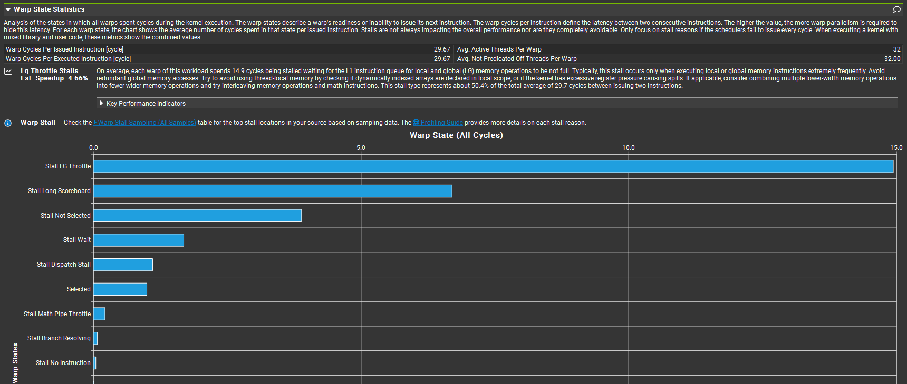

#### 2.3.3 并行度与资源占用

Achieved Occupancy [%]=99.58，并行度不是性能瓶颈。

#### 2.3.4 内存带宽分析

* **DRAM Throughput [%] = 4.04**

  这个值依然非常低，说明：大多数访问被 L1 / L2 吸收，外部带宽不是限制因素。

* **L2 Throughput = 19.00%，Hit Rate = 94.16%**

  说明：

  * L2 命中率很高 → block 间数据重用存在

  * L2 本身并不繁忙 → 不是 L2 带宽问题

  * L2 不是瓶颈，也不是延迟来源。

* **L1/TEX Cache Throughput = 95.34%，Mem Pipes Busy = 95.34%，Max Bandwidth = 95.34%**

  这三个指标同时“贴顶”，说明：**L1/TEX memory pipeline 已经被完全打满**，结合前面的 Warp Stall 分析可知，这依然不意味着内存带宽不够，而是：**单位时间内，发射了“过多的 LG（local/global）memory 指令”**。

* **L1/TEX Hit Rate = 89.18%**

  hit rate 很高 → **数据很快就能拿到**，说明 stall 不是因为“等数据回来”，而是因为 **L1/TEX pipeline 本身排队了**，这也对应了前面 Warp Stall 的分析结果。

| metric                      | value |
| --------------------------- | ----- |
| Memory Throughput [%]       | 95.34 |
| L1/TEX Cache Throughput [%] | 95.34 |
| L2 Cache Throughput [%]     | 19.00 |
| DRAM Throughput [%]         | 4.04  |

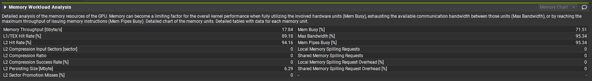

### 2.4 本章小结

当前 naive kernel 相比于cuBLAS 实现存在极大差距，主要瓶颈位于：SM 内部的 **memory issue / L1 pipeline**，表现为 LG Throttle Stall。原因在于：

* global load 指令数量过多
* load 指令发射频率过高
* 单次 load 的数据复用率极低

调优方向为：减少 load 指令数量，并通过提高**数据复用**降低 load 指令发射频率。

调优手段包括：

* 使用 Shared Memory
* 单个线程计算多个输出元素（Register Blocking）
* 向量化加载

## 3、分层优化路径

（本节按照“瓶颈识别 → 对应优化策略 → 新瓶颈出现”的顺序，逐步逼近性能上限，每一轮优化都会引入新的约束，因此不存在“一次到位”的最优设计！）

需要回答的问题：

* 当前瓶颈是什么？为什么会出现这个瓶颈？
* 有哪些手段解决？选择哪一个手段以及为什么选这个手段？
* 优化后效果如何？新瓶颈在哪里？

### 3.1 Shared Memory & Register Blocking

Shared Memory 的访问延迟远低于 Global Memory ，在需要频繁 Load 的算子中，将数据加载到 Shared Memory 再访问，能有效降低访问延迟。但是要真正减少 Load 指令的使用，还需要寄存器级的数据复用，即每个线程计算多个输出元素。举个例子：naive kernel 中每加载两个输入元素，只能计算一次输出元素，但当每个线程计算 $4\times4$ 个输出元素 时，只需要加载 $4+4$ 个输入元素，就能计算 $4\times4$ 次输出元素，数据复用程度显著提高。

1. **代码实现**

   分块尺寸 TILE_M = TILE_N = TILE_K = 16，每个线程计算 $4\times4$ 个输出元素

   ```c++
   // block shape
   constexpr int BM = 32;
   constexpr int BN = 32;
   constexpr int BK = 16;
   // the number of elements that each thread needs to move
   constexpr int movePerThreadAs = BM * BK / (BM/4 * BN/4);
   constexpr int movePerThreadBs = BK * BN / (BM/4 * BN/4);
   
   __global__ void gemm(
       const __nv_bfloat16* A, 
       const __nv_bfloat16* B, 
       float* C,
       const int M, const int N, const int K
   ) {
       int tid = threadIdx.y * blockDim.x + threadIdx.x;
   
       __shared__ __nv_bfloat16 As[BK][BM];
       __shared__ __nv_bfloat16 Bs[BK][BN];
   
       float sum[4][4] = {0.0f};
       const int rowAs = tid / (BM / movePerThreadAs);
       const int colAs = tid % (BM / movePerThreadAs);
       const int rowBs = tid / (BN / movePerThreadBs);
       const int colBs = tid % (BN / movePerThreadBs);
       for (int k0 = 0; k0 < K; k0 += BK) {
           // Load As and Bs
           // Transpose A for the low bank conflict in the compute stage
           for (int i=0; i<movePerThreadAs; ++i) {
               if (blockIdx.y * blockDim.y + colAs * movePerThreadAs + i < M && k0 + rowAs < K) {
                   As[rowAs][colAs*movePerThreadAs + i] = \
                   A[(blockIdx.y * blockDim.y + colAs * movePerThreadAs + i)*K + k0+rowAs];
                   // A[blockIdx.y * blockDim.y + colAs * movePerThreadAs + i][k0+rowAs];
               } else {
                   As[rowAs][colAs*movePerThreadAs + i] = __float2bfloat16(0.0f);
               }            
           }  
   
           for (int i=0; i<movePerThreadBs; ++i) {
               if (k0 + rowBs < K && blockIdx.x*blockDim.x+colBs*movePerThreadBs + i < N) {
                   Bs[rowBs][colBs*movePerThreadBs + i] = \
                   B[(k0 + rowBs)*N + blockIdx.x*blockDim.x+colBs*movePerThreadBs + i];
                   // B[k0 + rowBs][blockIdx.x*blockDim.x+colBs*movePerThreadBs + i];
               } else {
                   Bs[rowBs][colBs*movePerThreadBs + i] = __float2bfloat16(0.0f);
               }
           } 
           
           __syncthreads();
   
           // iterate
           const int rowBase = threadIdx.y * 4;
           const int colBase = threadIdx.x * 4;
           for (int kk = 0; kk < BK; ++kk) {
               float a[4] = {
                   __bfloat162float(As[kk][rowBase]),
                   __bfloat162float(As[kk][rowBase + 1]),
                   __bfloat162float(As[kk][rowBase + 2]),
                   __bfloat162float(As[kk][rowBase + 3])
               };
               float b[4] = {
                   __bfloat162float(Bs[kk][colBase]),
                   __bfloat162float(Bs[kk][colBase + 1]),
                   __bfloat162float(Bs[kk][colBase + 2]),
                   __bfloat162float(Bs[kk][colBase + 3])
               };
               
               for (int i = 0; i < 4; ++i) {
                   for (int j = 0; j < 4; ++j) {
                       sum[i][j] += a[i] * b[j];
                   }
               } 
           }
           __syncthreads();           
       }
       // write back
       int row = blockIdx.y * BM + threadIdx.y * 4;
       int col = blockIdx.x * BN + threadIdx.x * 4;
       for (int i = 0; i < 4; ++i) {
           for (int j = 0; j < 4; ++j) {
               if (row + i < M && col + j < N) {
                   C[(row + i) * N + col + j] = sum[i][j];
               }           
           }
       }
   }
   ```

2. **性能对比**

   | 实现方式           | naive  | cuBLAS | shared memory & register blocking |
   | ------------------ | ------ | ------ | --------------------------------- |
   | 运行时间（ms）     | 88.628 | 2.684  | 33.260                            |
   | 实测性能（TFLOPS） | 1.55   | 51.21  | 4.13                              |

   优化后，实际性能相比于 naive kernel 提升幅度超过 160%，但相比于 cuBLAS 版本还有很大差距。

3. **瓶颈定位**

   * **计算资源利用率**

     FMA 单元利用率由 14.50% 上升到 25.51%，说明通过 Shared Memory 与 Register Blocking 优化，但计算单元已获得更充分使用。
     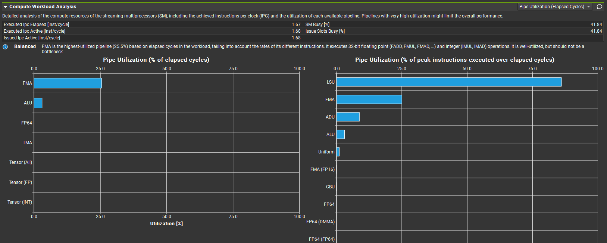

   * **Warp Stall 分析**

     当前主要瓶颈是 **Stall MIO Throttle**，Warp 发射效率受限于 **MIO pipeline 饱和**。

     该瓶颈与 kernel 结构强相关，来源于高频 shared memory load 和 bf16 → float 转换指令。相比于 naive 版本的主要瓶颈 LG Throttle Stall，修改后的 LG Throttle Stall 极低，表明指令发射瓶颈从 global/local memory 路径，转移到了 shared memory / MIO 路径。不过当前 kernel 仍属于 **指令吞吐受限（instruction issue bound）**，而非纯计算或全局内存带宽受限。

     优化方向：

     * 减少 MIO 指令数量（首要）
   
       使用向量化加载，降低 shared memory load 指令数量，但需要面临更高的内存对齐要求和增加尾块处理，会显著增加 kernel 复杂度
   
     * 提高寄存器复用率，降低 smem 读频率
   
       扩大 register blocking 尺寸，用计算密度换 MIO 压力，但这会增加寄存器压力，可能减少驻留 warp 数量，降低并行度
   
     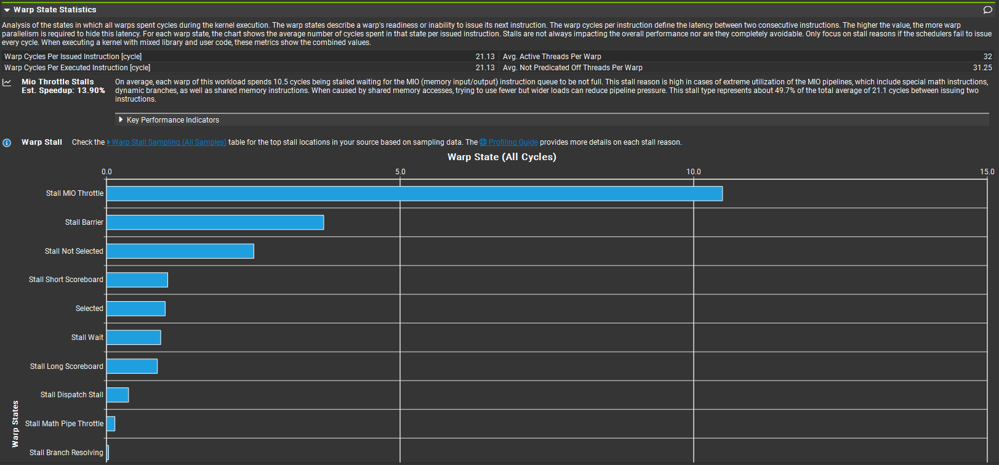
   
   * **并行度与资源占用**
   
     虽然 Achieved Occupancy [%] = 73.79，相比于 naive 版本有所降低，但这是 register blocking 增大寄存器开销的必然结果，鉴于 kernel 性能提升幅度巨大，此处并行度下降值得。
   
   * **内存带宽分析**
   
     Memory workload analysis 表明，优化后的 kernel 不受全局内存带宽的限制。L2 命中率接近 100%，说明 block 间 reuse 很好，A / B tiles 在 L2 中被有效复用，L1 命中率中等，但不构成瓶颈。
     
     尽管 global load / store 访问模式显示出较低的 sector 利用率，但由于 shared memory 分块和 register blocking 降低了全局内存操作的频率，其影响也受到了限制。内存相关的主要低效性源于 shared memory 存储操作，在这种操作中，bf16 数据布局导致频繁的多路 bank conflict，这些冲突增加了 MIO 管道的压力，并导致 Stall MIO Throttle，但其影响主要局限于预加载阶段。在 compute 阶段，shared memory 的 load 次数远多于 store，而我们已通过 As 转置显著降低了 load 时的 bank conflict，相当于已经把最昂贵阶段的 bank conflict 降掉了，因此 Shared Store Bank Conflicts 是一个问题，但并不致命。
     
     | metric                      | Shared Memory & Register Blocking |
     | --------------------------- | --------------------------------- |
     | Memory Throughput [%]       | 86.10                             |
     | L1/TEX Cache Throughput [%] | 86.31                             |
     | L2 Cache Throughput [%]     | 17.95                             |
     | DRAM Throughput [%]         | 0.44                              |
   
     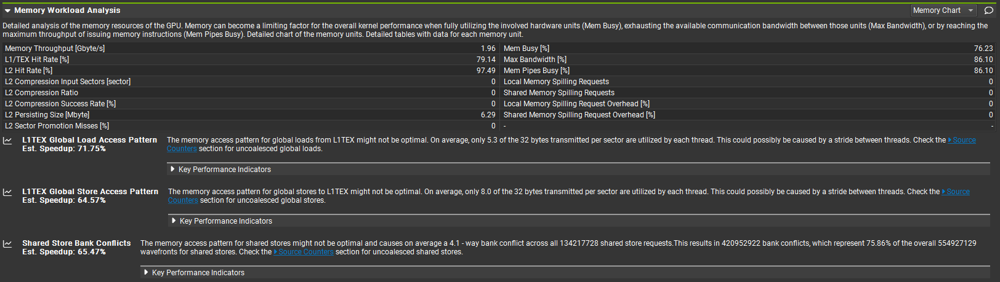
     
   
4. **本章小结**

   在 shared memory + register blocking 的基础上，load 阶段的一个潜在问题是 shared memory bank conflict，尤其是在使用 bf16 等 2-byte 数据类型时，必然导致一个 bank 中存入两个数据，天然容易产生 bank conflict。

   一种常见的缓解方式是使用向量化加载（如将两个 bf16 合并为 4-byte 访问），从而改善 bank 对齐并减少指令数量。降低 bank conflict 的同时也缓解 MIO pipeline 压力，解决 Stall MIO Throttle 这一瓶颈。

   然而，该方法：

   * 主要针对特定数据布局和对齐条件；

   - 在矩阵尺寸不规则时需要额外的尾块处理；
   - 显著增加 kernel 的实现复杂度；
   - 且并未从根本上消除 shared memory 冲突问题。

   因此，在本报告的优化路径中，我们选择不进一步展开向量化实现，在下一阶段将直接进入 warp-level，利用寄存器通信从根本上规避 shared memory 的 bank conflict。

### 3.2 Warp-Level

该 warp-level kernel 并不追求极致性能，而是作为 shared memory + register blocking 之后的**结构性跃迁示例**：通过 warp 内寄存器通信彻底绕开 shared memory，从根本上避免 bank conflict 和 `__syncthreads()` 同步开销。

1. **代码实现**

   ```c++
   // each warp computes one 16x16 tile
   constexpr int WM = 16;
   constexpr int WN = 16;
   // number of elements that each thread compute
   constexpr int numPerThread = WM * WN / 32;
   constexpr int colParts = WN / numPerThread;
   
   __global__ void gemm(
       const __nv_bfloat16* A, 
       const __nv_bfloat16* B, 
       float* C,
       const int M, const int N, const int K
   ) {
       // blockDim.x must be a multiple of warp size (32)
       int warpId = (blockIdx.x * blockDim.x + threadIdx.x) / 32;
       int lane = threadIdx.x % 32;
   
       // rowID and colID of current tile in matrix C
       int CRowBase = (warpId / (N / WN)) * WM;
       int CColBase = (warpId % (N / WN)) * WN;
   
       // thread output
       int row = (lane / colParts) + CRowBase;
       int colBase = (lane % colParts) * numPerThread + CColBase;
   
       float acc[numPerThread] = {0.0f};
   
       // iterate
       for (int kk = 0; kk < K; ++kk) {
           // load A
           float a = __bfloat162float(A[(CRowBase + lane / colParts) * K + kk]);
   
           // load B
           float b = __bfloat162float(B[kk * N + CColBase + lane % WN]);
   
           // broadcast b inside warp
           for (int i = 0; i < numPerThread; ++i) {
               float bi = __shfl_sync(0xffffffff, b, (lane % colParts) * numPerThread + i);
               acc[i] += a * bi;
           }
       }
   
       // write back
       for (int i = 0; i < numPerThread; ++i) {
           C[row * N + colBase + i] = acc[i];
       }
   }
   ```

2. **性能对比**

   | 实现方式           | naive  | cuBLAS | shared memory & register blocking | warp-level |
   | ------------------ | ------ | ------ | --------------------------------- | ---------- |
   | 运行时间（ms）     | 88.628 | 2.684  | 33.260                            | 74.288     |
   | 实测性能（TFLOPS） | 1.55   | 51.21  | 4.13                              | 1.85       |

   实测 warp-level 性能略优于 naive 版本，远不如 cuBLAS 和 shared memory & register blocking 版本。

3. **瓶颈定位**

   * **计算资源利用率**

     尽管 warp-level kernel 中每个线程计算了更多输出元素，计算单元的利用率反而低于 naive 实现，原因在于 warp-level 实现引入了大量 warp 内通信指令，FMA 指令对 `__shfl_sync` 结果形成了严格依赖，限制了**指令级并行度**，从而降低了 FMA 管线的持续占用率。

     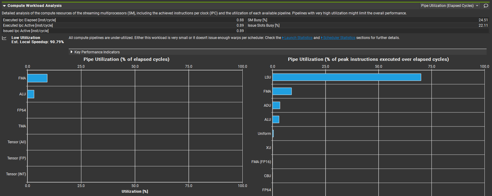

     尽管 warp-level kernel 中每个线程计算了更多输出元素，
      其 FMA 单元利用率反而低于 naive 实现。
      原因在于 warp-level 实现引入了大量 warp 内通信指令，
      FMA 指令对 `__shfl_sync` 结果形成了严格依赖，
      限制了指令级并行度，
      从而降低了 FMA 管线的持续占用率。

     这一现象表明，当计算与存储瓶颈被消除后，
      kernel 性能开始受到 warp 执行模型和指令调度的限制，
      进一步优化需要引入更深层次的并行展开或专用硬件支持。

   * **warp stall 分析**

     主要瓶颈依然是 **Mio Throttle Stalls**，相比于 Shared Memory & Register Blocking 实现，warp-level 实现虽然避免了高频 shared memory load指令，但由于由于缺乏跨 warp 的数据复用，不仅需要频繁使用 `__shfl_sync` 进行寄存器级通信，同时也不可避免地增加了全局内存加载指令的数量。这两类指令均通过 MIO pipeline发射，因此 MIO pipeline 再次被打满。所以该 warp-level 实现实际上是将 shared memory 的 bank conflict 瓶颈转移到了 warp-level MIO pipeline 竞争。这是一个**结构性迁移**，不是“白赚”。

     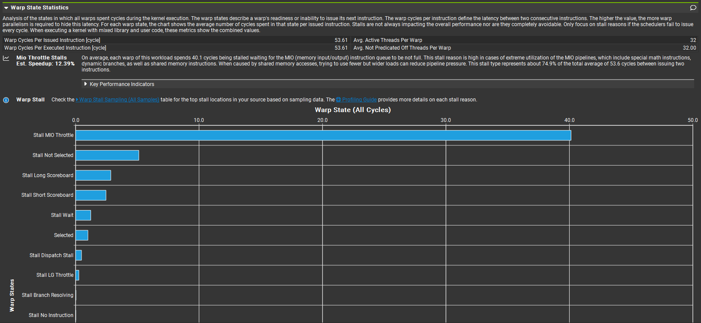

   * **并行度与资源占用**

     Achieved Occupancy [%] = 98.89，并行度不是瓶颈。

   * **内存带宽分析**

     从 Memory Workload Analysis 可以观察到，该 kernel 的 DRAM 与 L2 带宽利用率较低，表明全局内存带宽并未成为限制因素。L1/TEX 管线很忙，但不是因为“拉不动数据”，而是因为“被频繁访问”。结合 Warp Stall Analysis 中显著的 MIO Throttle stall，可以判断当前性能瓶颈主要来源于指令发射与 warp 级通信带来的管线竞争，而非内存带宽或计算吞吐能力本身。
     
     | metric                      | value |
     | --------------------------- | ----- |
     | Memory Throughput [%]       | 87.61 |
     | L1/TEX Cache Throughput [%] | 87.70 |
     | L2 Cache Throughput [%]     | 11.27 |
     | DRAM Throughput [%]         | 3.26  |
     
     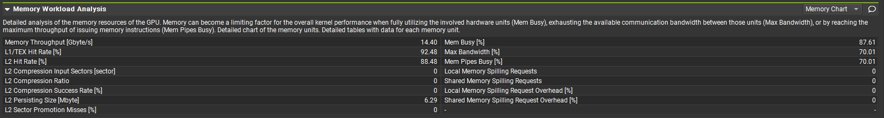

4. **本章小结**

   在消除全局访存瓶颈之后，shared memory + register blocking 通常能够显著提高算术强度，并在多数情况下取得稳定且可扩展的性能。然而，其性能上限仍然受到 shared memory bank conflict 以及同步开销的制约。

   warp-level 方法通过利用寄存器级通信，在理论上可以完全消除 shared memory 带来的 bank conflict 与同步开销，因此在特定规模和访存模式下表现出明显优势。上一节通过一个完整的 warp-level GEMM kernel，展示了这一思想在实践中的可行性。

   然而，当矩阵规模较大、尤其是 K 维度较深（如 K = 4096）时，仅依赖 warp-level 的计算模式会显著降低对输入数据的跨 warp 复用能力，使得单个 warp 在计算过程中需要执行更多加载、shuffle 以及标量计算指令。此时，性能瓶颈不再主要来源于内存带宽，而是逐渐转移到 warp 内部的指令发射与执行资源，从而限制了整体吞吐率的进一步提升。因此，warp-level 并不能作为 shared memory + register blocking 的普遍替代方案。

   在实际的高性能 GEMM 实现中，warp-level 通常并非独立存在，而是作为 block-level tiling 结构中的一个组成层级，用于构建高效的微内核（micro-kernel）。典型的分层结构如下：
   
   - **block-level shared memory tiling**：负责跨 warp 的数据复用
   - **warp-level micro-kernel**：负责在 warp 内部高效组织计算
   - **thread-level register blocking**：最大化指令级并行与寄存器复用
   
   这种多层次的设计在保持较高数据复用率的同时，尽可能降低了共享资源带来的冲突与同步成本。
   
   在此基础上，现代 GPU 在 warp-level 引入了专用的矩阵计算单元 —— Tensor Core。Tensor Core 可以被视为对 warp-level micro-kernel 的硬件化实现：它在保持 warp 级执行模型不变的前提下，将原本由大量标量指令与寄存器通信完成的矩阵运算，映射为高吞吐、低延迟的专用指令，从而在根本上缓解了指令发射受限的问题。下一章将围绕 Tensor Core 的编程模型展开，展示其如何在上述分层结构之上进一步突破 GEMM 的性能上限。
   
   > 本文并未进一步展开 shared memory 中嵌套 warp-level micro-kernel 的完整实现，其原因在于该方案在工程实现上高度复杂，且其核心思想将在 Tensor Core 编程模型中以更直接、更稳定的形式体现。因此，在方法论展示上，本文选择直接进入 Tensor Core 阶段。

### 3.3 Tensor Core 

前几章通过逐步引入 shared memory、register blocking 以及 warp-level 原语，系统地展示了 GEMM 在软件层面的优化路径。这一过程的核心目标，是在 SIMT 执行模型下不断**提高数据复用率**、**降低访存与同步开销**，并尽可能**提升算术密度**。然而，当优化深入到 warp 级别后，软件实现开始触及新的瓶颈：大量标量指令与寄存器级通信使得性能逐渐受限于**指令发射**与**执行资源**，而非内存系统本身。

Tensor Core 正是在这一背景下出现的。它并非对现有计算单元的简单加速，而是针对 warp-level 矩阵运算这一特定模式，引入的专用硬件执行路径。从编程模型上看，Tensor Core 依然以 warp 为最小执行单位，但将原本需要由多个加载、shuffle 以及 FMA 指令共同完成的矩阵乘加操作，压缩为少量高吞吐的专用指令，从而显著降低了指令数量并提高了执行效率。

从结构角度来看，Tensor Core 可以被理解为对 **warp-level micro-kernel** 的**硬件化实现**。在软件实现中，warp-level micro-kernel 需要显式地组织线程分工、数据广播以及寄存器累加；而在 Tensor Core 中，这些细节被封装进硬件逻辑之中，由固定的数据通路和调度机制自动完成。这种转变使得开发者不再需要在指令级别权衡寄存器通信与计算展开，而可以直接围绕更高层次的矩阵运算进行优化。

需要注意的是，**Tensor Core 并未改变高性能 GEMM 的整体分层结构**。即便在使用 Tensor Core 时，block-level 的 shared memory tiling 依然承担着跨 warp 数据复用的职责，而 Tensor Core 则作为 warp-level 计算单元嵌入其中，负责高效地执行核心的矩阵乘加操作。因此，理解前文所讨论的 shared memory、warp-level 以及 register blocking 的作用，对于正确使用 Tensor Core 仍然至关重要。

在接下来的内容中，将以 NVIDIA 提供的 **WMMA 编程模型** 为例，介绍 Tensor Core 的基本使用方式，并结合前文的分层优化思路，展示如何将 Tensor Core 融入到完整的 GEMM kernel 中，逐步靠近 cuBLAS 所能实现的性能上限。

1. **代码实现**（基于 **WMMA** 的实现）

   ```c++
   // Block tile
   constexpr int BM = 64;
   constexpr int BN = 64;
   constexpr int BK = 16;
   // Warp tile
   constexpr int WM = 16;
   constexpr int WN = 16;
   constexpr int WK = 16;
   
   __global__ void gemm(
       const __nv_bfloat16* A, 
       const __nv_bfloat16* B, 
       float* C,
       const int M, const int N, const int K
   ) {
       // block-level tile
       int blockRow = blockIdx.y * BM;
       int blockCol = blockIdx.x * BN;
   
       // warp identification inside block
       int warpId = threadIdx.x / 32;
   
       // 4*4 warps per block
       int warpRow = warpId / (BN/WN);
       int warpCol = warpId % (BN/WN);
   
       // shared memory
       __shared__ __nv_bfloat16 As[BM][BK];
       __shared__ __nv_bfloat16 Bs[BK][BN];
   
       // WMMA fragments
       wmma::fragment<wmma::matrix_a, WM, WN, WK, __nv_bfloat16, wmma::row_major> a_frag;
       wmma::fragment<wmma::matrix_b, WM, WN, WK, __nv_bfloat16, wmma::col_major> b_frag;
       wmma::fragment<wmma::accumulator, WM, WN, WK, float> c_frag;
       wmma::fill_fragment(c_frag, 0.0f);
   
       // iterate
       for (int kk = 0; kk < K; kk += BK) {
           // load A tile
           for (int idx = threadIdx.x; idx < BM * BK; idx += blockDim.x) {
               int i = idx / BK;
               int j = idx % BK;
               As[i][j] = A[(blockRow + i) * K + kk + j];
           }
   
           // load B tile
           for (int idx = threadIdx.x; idx < BK * BN; idx += blockDim.x) {
               int i = idx / BN;
               int j = idx % BN;
               Bs[i][j] = B[(kk + i) * N + (blockCol + j)];
           }
   
           __syncthreads();
   
           // load fragments from shared memory
           wmma::load_matrix_sync(
               a_frag,
               &As[warpRow * WM][0],
               BK
           );
   
           wmma::load_matrix_sync(
               b_frag,
               &Bs[0][warpCol * WN],
               BK
           );
   
           // Tensor Core MMA
           wmma::mma_sync(c_frag, a_frag, b_frag, c_frag);
   
           __syncthreads();
       }
   
       // write back
       wmma::store_matrix_sync(
           &C[(blockRow + warpRow * WM) * N + blockCol + warpCol * WN],
           c_frag,
           N,
           wmma::mem_row_major
       );
   }
   ```

2. **性能对比**

   | 实现方式           | naive  | cuBLAS | shared memory & register blocking | warp-level | tensor core |
   | ------------------ | ------ | ------ | --------------------------------- | ---------- | ----------- |
   | 运行时间（ms）     | 88.628 | 2.684  | 33.260                            | 74.288     | 14.510      |
   | 实测性能（TFLOPS） | 1.55   | 51.21  | 4.13                              | 1.85       | 9.47        |

   相较于前面几种优化方式，有较大提升，但与 cuBLAS 的极致性能相比还有很大差距。

3. **瓶颈定位**

   * **计算资源利用率**

     显然，tensor core 没有被“喂饱”，猜测性能瓶颈在数据供给或并行度设计上，而不是在 mma 本身。

     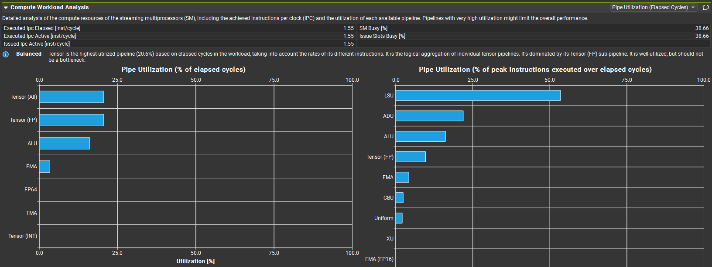

   * **warp stall 分析**

     warp stall 信息说明该算子的问题在于 global memory → shared memory 访存延迟，Tensor Core 完全不是瓶颈。出现这种访存延迟的原因主要在于当前 kernel 的循环结构是：

     * global → shared
     * syncthreads()
     * shared → fragment
     * mma
     * syncthreads()

     缺乏 double buffer 和 load、compute 异步执行。

     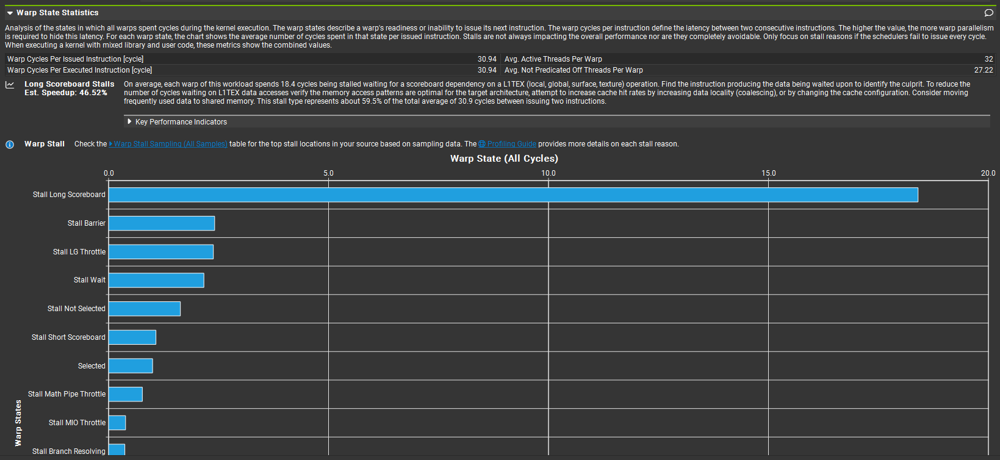

   * **并行度分析**

     Achieved Occupancy [%] = 99.61，说明访存延迟非常严重，即使并行度拉满也无法掩盖。

   * **内存带宽分析**

     主要有两个问题：
     
     L1/TEX 命中率极低，几乎每次加载都要从 L2 甚至 global 加载，这正是 Long Scoreboard Stall = 59.5% 的根源之一；
     
     shared memory 存在严重 bank conflict（≈2-way）；
     
     这些原因导致了访存延迟极高，Tensor Core 被严重饿死。
     
     | metric                      | value |
     | --------------------------- | ----- |
     | Memory Throughput [%]       | 53.48 |
     | L1/TEX Cache Throughput [%] | 53.52 |
     | L2 Cache Throughput [%]     | 14.72 |
     | DRAM Throughput [%]         | 18.53 |
     
     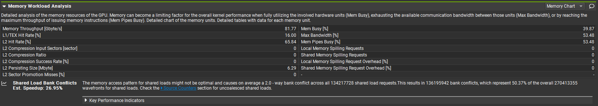

4. **本章小结**

   基于 Nsight Compute 的分析可以确认，当前 WMMA 版本的 GEMM kernel 并未受限于 Tensor Core 的峰值计算能力，而是主要受制于**内存访问延迟**与**数据供给效率**。具体表现为：
   
   * warp 在全局内存及共享内存加载阶段存在大量 Long Scoreboard Stall，Tensor Core 长时间处于空闲状态；
   * 共享内存访问存在显著的 bank conflict，进一步放大了共享内存到计算单元的数据供给延迟；
   * SM 活跃度与 Tensor Core 利用率均明显低于理想水平。
   
   相关优化思路的可行性分析如下：
   
   1. **K 维 double buffer**：形式成立，但无法形成真正的重叠
   
      一种直观的优化思路是在 K 维度上引入双缓冲机制，以期在当前 tile 计算的同时预取下一 tile 的数据，从而隐藏内存访问延迟。然而，该方法并不可行。
   
      根本原因在于，在**不使用 cp.async / ldmatrix 等低层指令的前提下**，仅依赖 WMMA API 本身，无法构建真正有效的 load–compute 异步流水线。在该模型下，全局内存加载、共享内存访问以及 Tensor Core 计算均由同一 warp 顺序执行。当 warp 发起全局或共享内存加载后，随后的 `wmma::load_matrix_sync` 与 `mma_sync` 指令仍然需要等待数据就绪，导致 warp 进入 Long Scoreboard Stall 状态。
   
      即使在逻辑上引入了双缓冲，不同阶段之间依然无法在执行层面重叠，因而无法有效隐藏内存访问延迟。
   
   2. **Shared memory swizzle / layout 优化**：受限于 WMMA 的访问语义
   
      针对共享内存 bank conflict，理论上可以通过调整数据布局或引入 swizzle 来改善访存并行性。然而，在 WMMA 编程模型下，此类优化的空间受到显著限制。`wmma::load_matrix_sync` 的访问模式由硬件与编译器隐式决定，程序员仅能控制基地址与 leading dimension，而无法显式指定 warp 内 lane 与矩阵元素的映射关系，难以改变数据供给受限的局面。
   
   3. **提高单 warp 计算密度**：受限于 fragment 抽象
   
      另一种可能的优化方向是提高单个 warp 的计算密度，例如让一个 warp 连续计算多个 fragment，以减少加载与控制开销在总指令流中的占比。然而，在 WMMA 模型下，该思路同样受到 fragment 抽象的限制。
   
      WMMA 的 fragment 设计本质上是一次性、不可复用的计算载体。每一次 `mma_sync` 都需要重新从共享内存加载对应的 A、B fragment，fragment 本身无法作为长期驻留的计算状态进行复用。
       尝试在单个 warp 中同时维护多个 fragment 不仅会显著增加寄存器压力，降低 occupancy，而且难以形成稳定的性能收益。因此，该方向在实际实现中往往得不偿失。
   
   综上所述，尽管双缓冲、数据重排以及提高计算密度等优化手段在理论上具有合理性，但在 WMMA 编程模型下均受到 **warp 同步执行、fragment 抽象以及隐式访存语义的共同限制**，难以构建真正有效的计算-访存流水线。这表明，WMMA 更适合作为 Tensor Core 的入门与教学接口，而非用于构建高性能、可扩展的 GEMM kernel。

### 3.4 cp.async + ldmatrix + mma.sync

要突破上述限制，唯一的途径是放弃 WMMA 的高层抽象，转而在更低层次上显式控制数据搬运与计算调度，例如：`cp.async + ldmatrix + mma.sync` 。

在 Ampere 架构上，`cp.async + ldmatrix + mma.sync` 代表了软件层面对 Tensor Core 调度的极致控制。

其中，`cp.async` 首次将全局内存到共享内存的数据搬运与计算指令流显式解耦，使得数据加载可以与 Tensor Core 计算并行执行；
 `ldmatrix` 以 warp 为粒度，从共享内存中加载并重排矩阵片段，以满足 Tensor Core 的数据布局需求；
 `mma.sync` 则将 Tensor Core 指令本身显性化，使程序员能够精确控制计算的粒度与时机。

通过这三者的组合，程序员可以在软件层面构建高度精细的流水线，最大限度地隐藏内存访问延迟，从而榨干单个 SM 的计算能力。然而，这种控制是以极高的实现复杂度为代价的。其实现细节高度依赖具体硬件特性与 tile 形态，不仅开发成本高，而且难以迁移和维护。

随着 Hopper 架构引入 TMA 与 WGMMA，原本需要由程序员显式管理的数据搬运、流水线调度与 warp 协作，正在被硬件自动化。在当前的工程实践中，这类高度手写的 kernel 已逐步进入维护期，而不再是新算子设计的主流方向。

因此，本文将 `cp.async + ldmatrix + mma.sync` 作为算子调优方法论上的一个重要历史节点加以介绍，但不展开其具体实现。相比之下，后续内容将聚焦于 TMA 与 WGMMA 所代表的、在当前及未来架构上仍具有持续价值的调优思维。

> 从这一点开始，算子优化的重心开始从“如何调度线程”转向“如何描述 tile”！

### 3.5 TMA + WGMMA

`cp.async + ldmatrix + mma.sync` 所代表的这种“软件层面的极致控制”，其复杂度与脆弱性也十分明显：其实现高度依赖具体架构细节与 tile 形态，对开发经验要求极高，且难以在不同 GPU 架构之间迁移。

在 Hopper 架构中，NVIDIA 通过引入 Tensor Memory Accelerator（TMA）与 Warp-Group MMA（WGMMA），将原本需要由程序员显式管理的数据搬运、流水线调度以及 warp 协作，进一步下沉至硬件层面。

TMA 负责在全局内存与共享内存之间以 tile 为单位进行高效、异步的数据传输，而 WGMMA 则以 warp-group 为粒度驱动 Tensor Core 计算，从根本上改变了 Tensor Core 的调度方式。

**需要指出的是**，这一编程模型目前并未以完整、稳定的 CUDA C++ 接口形式向开发者开放，其实际使用主要依赖于 cuTe 及 CUTLASS 3.x 等高度模板化的框架。因此，本文不尝试对 TMA + WGMMA 的具体实现展开讨论。

TMA 与 WGMMA 所体现的设计思想具有重要意义：算子优化的重心正在从“如何精细调度线程”转向“如何抽象与描述 tile 的结构与依赖关系”。这一转变为后续基于**高层算子组合与融合**的优化方法奠定了基础。

## 4、总结与展望

### 4.1 总结

本文以 GEMM 为例，从 naive CUDA kernel 出发，沿着 shared memory、register blocking、warp-level 原语直至 Tensor Core，系统地梳理了 GPU 上矩阵乘法算子的典型分层优化路径。通过逐阶段的性能分析可以看到，算子优化并非“不断叠加技巧”的线性过程，而是一个**瓶颈不断转移、约束不断收紧的演进过程**。

在早期阶段，GEMM kernel 的性能表面上表现为“访存相关 stall”，但通过 Nsight Compute 的深入分析可以发现，其根本原因并非全局内存带宽不足，而是 **SM 内部指令发射与访存管线资源的竞争**。

随着 Tensor Core 的引入，计算吞吐能力发生数量级提升，单条 `mma` 指令在极短时间内消耗大量输入数据，算子第一次对数据供给能力提出了远高于以往的要求。在这一阶段，内存访问延迟与数据搬运效率才真正开始主导整体性能表现，Tensor Core 的利用率直接受限于 load–compute 流水线是否能够有效重叠。这标志着**性能瓶颈从“内部执行资源竞争”向“数据供给能力不足”的实质性转移**。

本文在 WMMA 阶段的实验与分析表明，仅依赖 CUDA C++ 层面的高层抽象，已经难以构建真正高效的计算–访存流水线。尽管双缓冲、数据重排与提高计算密度等优化手段在理论上成立，但在 WMMA 的执行语义与 fragment 抽象约束下，往往难以转化为稳定的性能收益。这标志着**传统 CUDA C++ 手写 kernel 在现代 GPU 架构上的能力边界**。

在 Ampere 架构中，`cp.async + ldmatrix + mma.sync` 提供了突破这一边界的可能，但其实现复杂度与维护成本极高，已逐渐从“通用优化手段”转变为“框架级实现细节”。随着 Hopper 架构引入 TMA 与 WGMMA，这一趋势进一步强化：数据搬运、流水线调度与 warp 协作正持续向硬件与系统软件层面下沉，而非由应用开发者显式管理。

从这一视角看，算子优化的重心正在发生根本转变：

**从“如何精细调度线程与指令”，转向“如何抽象、组合与描述 tile 结构及其依赖关系”。**

在当前与未来的工程实践中，这意味着：

- 底层高性能 kernel 越来越多地由高度专业化的库（如 cuBLAS、CUTLASS）提供；
- 应用与模型层面的性能优化，更应聚焦于算子选择、算子融合、调度策略与高层框架（如 Triton）的使用；
- 对底层机制的理解依然重要，但其价值更多体现在**正确使用与组合现有工具**，而非重复实现其内部细节。

因此，本文所展示的 GEMM 调优过程，既是一条可复现的学习路径，也是一条清晰的“止步线”：它帮助我们理解性能从何而来，也明确指出了在现代 GPU 架构下，哪些问题已经不再适合通过手写 CUDA kernel 来解决。

### 4.2 展望

在当前的大模型训练与推理场景中，单一 GEMM kernel 的性能已经很少成为瓶颈。真正决定系统性能的，往往是：

* 算子之间的数据流结构（如 attention 中 QKV → softmax → GEMM 的整体组织）；

* 是否能够避免中间结果的落地（SRAM vs DRAM）；

* 是否能够通过融合减少访存与同步；

这些优化往往无法通过单个 kernel 的微调实现，而需要从算子层面重新设计算法与执行顺序。

在完成 CUDA C++ 能力范围内的 GEMM 优化路径梳理之后，后续不再继续深挖更底层的微内核实现，而将关注点转向：

* 基于 Triton 的算子级实现与融合优化；

* 使用 cuBLASLt 等库作为性能上限参考，理解其调度策略；

* 面向大模型训练与推理场景的端到端性能分析与优化；

下一步工作将以 FlashAttention 等典型算子为例，进一步展示算子融合与结构性优化在现代 GPU 架构下的实践方式。
